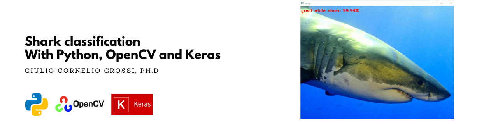
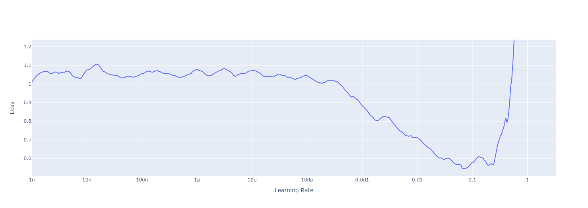

# sharknado



#### _Introduction_

In my effort to learn computer vision with OpenCV and Python I found that a classifier would be a good project to play around with Keras functionalities and Deep Learning libraries/ architectures. And what is better than putting together my passion for Sharks and Data Science and have some good moments? So here is my project of **sharknado: Shark Classification with Python, OpenCV and Keras**.

Before describing a little bit what is inside the repository, I would like to clarify the intention of the project. The idea is not to obtain state of the art precision in shark classification, but revising some important deep learning concept: architectures, hyperparameter tuning, data augmentation, regularisation and so on. For this reason the project is always moving, and I constantly add some tools or test new architectures.

#### Difficulty of the Task

I think is worth spending a couple of words regarding the difficulty of the task. Many books regarding machine learning, as well as blogs present the classification task on "Hallo Word" datasets like (MNIST or Fashion MNIST) or on easily separable datasets, for which a high accuracy can be reached even with simple models and which require not a big effort to train. The task with sharks has an higher level of complicancy because:
- sharks have almost the same shape.
- sharks have almost the same color.
- sharks are often along other sharks.
- under certain angles (i.e. looking from below) is practically impossible to distinguish them.

For this reason I guess that high level features are not really sufficent to distinguish between them, and a some point we will hit a limit posed by:
- The availability of shark images 
- The compromise between the complexity of the architecture used and computing power.

Nonetheless we can try to still reach a reasonable accuracy with not so much computing power, with something that can run on Google Colab without timing-out the runtime.

#### Dataset

[](https://drive.google.com/drive/folders/19haNnXAuVGM1qFYq9Sa5Ktl7RLVgJDPI?usp=sharing)

For the reasons mentioned above I will try to keep it as simple as possible and I will, for the moment, concentrate my efforts on a binary classifier that will distinguish between white shark and hammerhead shark. Why so? Because at least I could teach the neural network to distinguish the tipical shape of the hammer of the hammerhead shark. Imagine if I started with a distinction between a tiger shark and a white shark. I think I would have miserably failed. As a matter of philosophy of data: you should always start with something simple and doable with your means, and only afterwards increase the complexity. This will give you already a feeling of the complexity of the task and the architecture that best fit your dataset.

The Dataset has been constructed using the Google Image Download Tool I introduced in [this article](https://gcgrossi.github.io/google-image-downloader/). I have collected about 950 images of white sharks and 750 images of hammerhead sharks. The directory structure is organized in the following way:

```
./
└───sharks
    ├───great_white_shark
    ├───hammerhead_shark
    ├───mako
    ├───tiger_shark
    └───whale_shark
```

The training phase will crawl the directories and assing a label to each image based on the folder name in which they are stored. The directory structure is therefore important to the project. You can find the dataset at the beginning of the section.

#### Architectures

Two architectures have been built from scratch: 

_Simple Fully Connected MLP_

```python
'''in simple_nn_train.py
define the 3072-1024-512-3 architecture using Keras'''

model = Sequential()
model.add(Dense(1024, input_shape=(3072,), activation="sigmoid"))
model.add(Dense(512, activation="sigmoid"))
model.add(Dense(len(trainY[0]), activation="softmax"))
```

_Small VGGNet_
```python
''' in architectures/smallvggnet.py'''

# CONV => RELU => POOL layer set
model.add(Conv2D(32, (3, 3), padding="same",input_shape=inputShape))
model.add(Activation("relu"))
model.add(BatchNormalization(axis=chanDim))
model.add(MaxPooling2D(pool_size=(2, 2)))
model.add(Dropout(0.25))
        
# (CONV => RELU) * 2 => POOL layer set with 64 filters
# ... omitted for clarity

# (CONV => RELU) * 3 => POOL layer set with 128 filters
# ... omitted for clarity
 
# first (and only) set of FC => RELU layers
model.add(Flatten())
model.add(Dense(512))
model.add(Activation("relu"))
model.add(BatchNormalization())
model.add(Dropout(0.5))
		
# softmax classifier
model.add(Dense(classes))
model.add(Activation("softmax"))

```

and have been trained separately.

#### Training

The training of the architectures is performed in ```simple_nn_train.py``` and in ```smallvgg_train.ipynb``` [](https://colab.research.google.com/drive/1H001_q6wBM2AzzPm5lltAHodUx6y7LpH?usp=sharing), on 75% of the total dataset. The training and parameter tuning for the first is straightforward and the model is trainable with CPU. The second model is more demanding in terms of computing power and should be run on Google Colab or with a GPU support. 

For the latter, the learning rate has been tuned using a learning the rate screener in ```smallvgg_find_lr.ipynb``` [](https://colab.research.google.com/drive/1HG_apHuNoXuTPPAipuLYwQR2rSnzPAXl?usp=sharing). The loss as a function of the learning rate is calculated for the training set and shown in the image below



a sweet spot is chosen when the loss starts to fall. 

#### Transfer Learning

A third training is also performed with a transfer learning technique. The complete VGGNet is downloaded with Keras:
```python
from tensorflow.keras.applications import VGG16

model = VGG16(weights="imagenet", include_top=False)
```
with weights from the imagenet dataset and without the Fully Connected Output layer. This pre-trained architecture is used as feature extractor in ```vggnet_feature_extraction_train.ipynb``` [](https://colab.research.google.com/drive/1apCl6v8eEV7t59lC_eP0GRGUMzbZZVVN?usp=sharing). In the Notebook, the features are extracted and stored in two separate .csv files stored in ```/output```. The training of a Logistic regression on the extracted features will handle the class prediction. This is done in two separate (but equivalent) ways:
1. in ```vggnet_feature_extraction_train.ipynb``` right after feature extraction. 
2. in ```vggnet_read_csvfeatures_train.ipynb``` [](https://colab.research.google.com/drive/12glb-Zq0lp25iJeqnPAJwUf3jU7yhEr8?usp=sharing) from the .csv files stored in ```/output```.

#### Results

The Accuracy metric as been chosen as a mean of comparison between the 3 approaches. First the accuracy on the validation set (25% of the total dataset) is presented:

|               | MLP           | Small VGG     | Tranfer Leaning (VGG) |
| ------------- | ------------- | ------------- | --------------------- |
| Accuracy      | 83%           | 86%           | 98%                   |

That shows the subsequent improvement in accuracy with increasing complexity of the network. The result is in line with the expectations introduced at the beginning of the project. The VGGNet has already learnt an important amount of features from the imagenet dataset that can be re-used on this specific task. We could not achieve a similar result with the limited amount of data and computing power available. Nonetheless and 86% accuracy is still a pretty decent result from an in-house model, given the complexity of the task. 

A mini test set of 60 images has been also dowloaded to understand the performance out-ofthe-sample. The images have deliberately chosen to be tricky and deceiving for the network. The images include drawings, toys and noisy images. Some examples can be find below:


